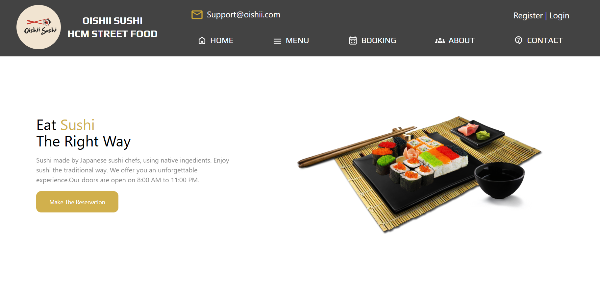

<h1 align="center">🍣 Sushi Management Store</h1>

<p align="center">
  A full-stack multi-role sushi restaurant management platform — from customer experience to company-wide administration.
</p>
<div align="center">
  
</div>
<div align="center">
  
  
  
  
</div>

---

## 📌 Table of Contents

- [About the Project](#about-the-project)
- [Tech Stack](#tech-stack)
- [Features](#features)
- [Installation](#installation)
- [Contributing](#-contributing)
- [Contributing](#contributing)
- [Contact](#contact)
- [Usage Guide](#usage-guide)

---

## 📖 About the Project

**Sushi Management Store** is a full-stack restaurant management system designed for a sushi restaurant chain. It supports multiple user roles, including customers, employees, branch managers, and company managers — providing seamless operations, from ordering and invoicing to feedback and reporting.

---

## 🚀 Tech Stack

- **Frontend**: ReactJS, TailwindCSS, html2pdf.js  
- **Backend**: NodeJS (ExpressJS)  
- **Database**: Microsoft SQL Server  
- **Other Tools**: GitHub, Figma, VS Code

---

## ✅ Features

### 👤 Customer
- 🏠 Home: View featured dishes & promotions
- 🍣 Menu: Browse sushi menu with prices
- 📅 Booking: Reserve tables at preferred branches
- ℹ️ Introduce: Learn about store values
- 💬 Contact: Submit feedback or inquiries

### 🧑‍🍳 Employee
- 🏠 Dashboard: Access employee homepage
- 📝 Menu Management: Update menu items
- 📦 Orders: Fulfill customer orders
- 🧾 Invoices: Generate order invoices
- 📖 Guide: Learn store workflow

### 🧑‍💼 Branch Manager
- 🏠 Dashboard: Branch overview
- 📝 Menu: Control branch-specific dishes
- 👥 Customers: View user interactions
- 👩‍💼 Employees: Manage employee info
- 💬 Feedback: Handle customer opinions
- 📊 Reports: Generate branch reports

### 🏢 Company Manager
- 🏠 Dashboard: Global overview
- 📋 Menu: Control master menu
- 👥 Customers: Centralized customer data
- 🧑‍💼 Employees: Manage cross-branch staff
- 🏬 Branches: Administer all branches
- 💬 Feedback: Handle system-wide feedback
- 📊 Reports: Analyze system performance

---

## 🛠️ Installation

```bash
# Clone the project
git clone https://github.com/OriginalNVK/SushiSystemStoreManagement.git
cd SushiSystemStoreManagement

# Install Frontend
cd Front-end
npm install
npm install html2pdf.js
cd ..

# Install Backend
npm install
```

---

## 📝 Usage Guide

### 1. Start the Application

- **Backend:**
  1. Open a terminal in the `Back-end` folder.
  2. Run `npm install` (if not done before).
  3. Configure your database connection in `.env` (see `sample.env`).
  4. Run `node index.js` or `npm start` to start the backend server (default: http://localhost:3000).

- **Frontend:**
  1. Open a terminal in the `Front-end` folder.
  2. Run `npm install` (if not done before).
  3. Run `npm run dev` to start the frontend (default: http://localhost:5173).

### 2. User Roles & Main Features

- **Customer:**
  - Đặt bàn, đặt món online, xem menu, gửi phản hồi.
  - Đăng ký tài khoản hoặc đăng nhập để sử dụng đầy đủ chức năng.

- **Employee:**
  - Đăng nhập để xác nhận đơn hàng, xuất hóa đơn, quản lý menu.

- **Branch Manager:**
  - Quản lý nhân viên, khách hàng, menu, xem báo cáo chi nhánh.

- **Company Manager:**
  - Quản lý toàn bộ hệ thống, các chi nhánh, nhân viên, khách hàng, báo cáo tổng hợp.

### 3. Booking & Order Flow

- **Đặt bàn/Đặt món:**
  1. Khách hàng chọn chi nhánh, ngày, giờ, số lượng khách, món ăn.
  2. Nhấn "Reserve Now" để gửi yêu cầu đặt bàn.
  3. Đơn hàng sẽ hiển thị ở trang quản lý cho nhân viên xác nhận.

- **Xác nhận đơn hàng:**
  1. Nhân viên đăng nhập, vào trang Order Online/Offline.
  2. Chọn đơn hàng chờ xác nhận, nhấn "Confirm Order" để xác nhận và xuất hóa đơn.

### 4. Notes

- Đảm bảo SQL Server đã chạy và đã import các script trong `Back-end/db/`.
- Nếu gặp lỗi kết nối, kiểm tra lại file `.env` và cấu hình SQL Server.
- Để thêm dữ liệu mẫu, có thể sử dụng các script trong thư mục `db`.

---

## 🤝 Contributing

- Original NVK: Front-end + Support back-end
- Dang Huy:
- Viet Hoang:
- Viet Hung:
- Thanh Huy:

## Contact

For further inquiries or contributions:

Project Lead: Nhom13

GitHub Repository: https://github.com/OriginalNVK/SushiSystemStoreManagement.git
